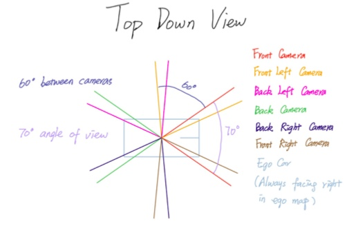
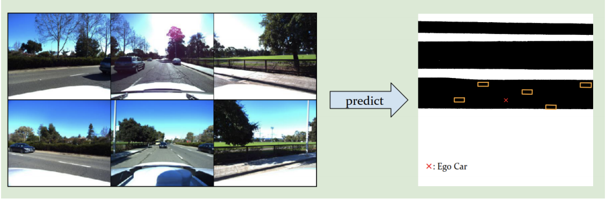
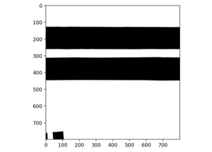
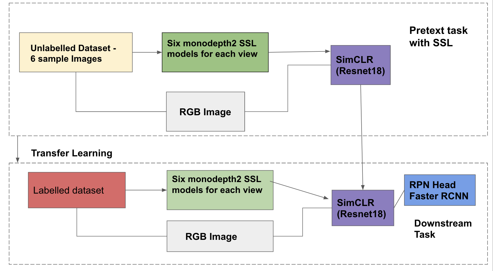
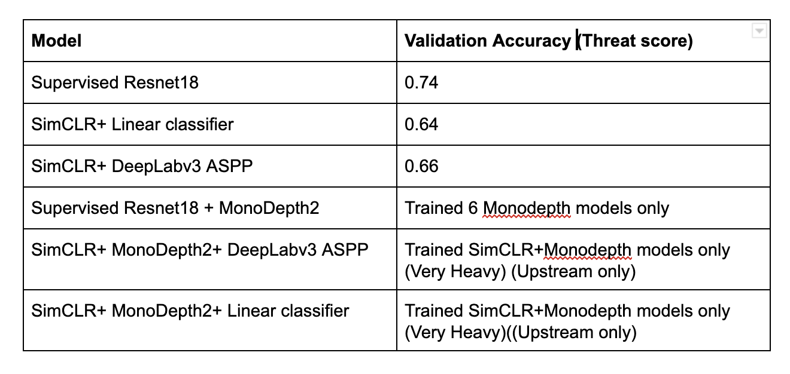
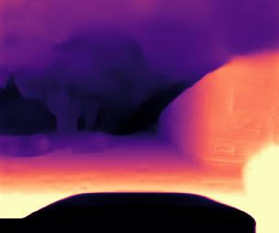

# Self Supervised Learning based Road Map Layout Generation and Object Detection

This project presents our approach, report and code for the Bounding Box Detection (3D Object Detection) and Road Layout Prediction(Semantic Segmentation) tasks with 6 monocular  images for each frame captured by six different cameras attached to the ego car, without Lidar Data, but with a vast quantity of unannotated/unlabelled data. The objective of the project was to be leverage the vast quantity of unlabelled data to extract better performance. The goal was to generate a top down view of the surrounding area for Road Map Layout prediction and Object Detection. In order to extract performance improvement from the Unlabelled data, For the Object Detection task, we used a simple framework for contrastive learning of visual representations(SimCLR), developed by Google wherein we passed Depth maps for the images as input, along with the images themselves, so that our SIMCLR Model could effectively learn representations. We generated depths using MonoDepth2,a Self Supervised Depth estimation, that uses Temporal Dynamics between images to predict Depth. We use these learned representations for our downstream task of Object Detection, by passing the learned representations to the Bounding Box Prediction head of Faster-RCNN, a SOTA 2D Object Detection Model. In addition we also trained a Faster RCNN model for this task. For the Road Layout Prediction task, we trained a Resnet 18 Model. In addition, we also passed learned representations from SIMCLR to DeepLab, a SOTA Semantic Segmentation Model.

## Cameras:

## Tasks:

### Bounding Box Detection

### Road Layout Prediction

## Architecture:

## Our Approach:

- Researched developing supervised, transfer, self supervised and semi-supervised learning frameworks for autonomous driving cars in Pytorch.

- Used SOTA Self Supervised Learning framework SimCLR, developed by Google, for learning representations for the downstream tasks of road layout prediction and object detection and classification. Fine tuned for downstream tasks using labelled data, that is transfer transfer and supervised learning with models specific to the Two Tasks

- Built end to end pipeline for pseudo-lidar with depth maps generated from MonoDepth2, a self supervised monocular depth estimation model, by projecting 3D point clouds into 2D image space and object detection and classification through Faster RCNN and Retinanet with Generalized IoU(Intersection over Union) loss.

## Results on the Hidden Competition Test:
Baseline:

LAG - 1 - Bounding Box Score: 0.01438 - Road Map Score: 0.704

Final:
LAG - 1 - Bounding Box Score: 0.017 - Road Map Score: 0.73

## Testing Results on our Test Set:

### Road Map Layout Prediction (Semantic Segmentation)

### Bounding Box Detection (3D Object Detection)

## Depth Maps Generated by MonoDepth2 :

## Report:

[Report](https://github.com/amartyap/Self-Supervised-Learning---Autonomous-Driving---Deep-Learning-Competition/blob/dependabot/pip/baseline/bleach-3.3.0/Final%20Report.pdf)

## Video Presentation

[Video](https://github.com/amartyap/Self-Supervised-Learning---Autonomous-Driving---Deep-Learning-Competition/blob/dependabot/pip/baseline/bleach-3.3.0/Video.mov)

## Team:

1. Amartya Prasad 
2. Sree Gowri Addepalli          
3. Sree Lakshmi Addepalli 

